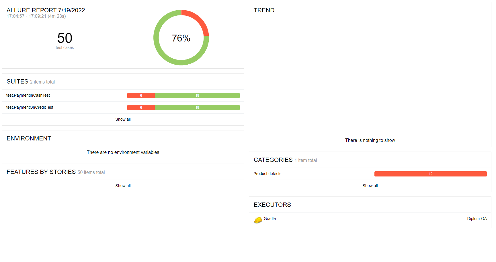

##Отчёт о проведённом тестировании

###Краткое описание
В ходе написания дипломного проекта была проведена работа по автоматизации тестирования сервиса, который взаимодействует с СУБД и API Банка. В качестве СУБД были использованны MySQL и PostgresSQL. API Банка представляет собой симулятор банковских сервисов, который может принимать запросы в нужном формате и генерировать ответы. Само приложение является веб-сервисом, который предлагает приобрести тур по определенной цене с помощью двух способов:
- Оплата по дебетовой карте
- Выдача кредита по данным банковской карты

###Количество тест-кейсов

Всего тестов произведено - 50 шт.

- Успешных тестов - 38 шт. (76%)

- Не успешных тестов - 12 шт. (24%)

Отчёт о тестирование был сформирован с помощью утилиты Allure Report.

###Общие рекомендации
В ходе тестирования были выявлены дефекты и заведены issues:
 * [Банк одобряет операцию при вводе ФИО с маленькой буквы](https://github.com/Rigo656/Diplom-QA/issues/1#issue-1309320027)
 * [Банк одобряет операцию при вводе в поле "Владелец" более 30 символов.](https://github.com/Rigo656/Diplom-QA/issues/2#issue-1309327328)
 * [Банк одобряет операцию при вводе спецсимволов, цифр в поле "Владелец".](https://github.com/Rigo656/Diplom-QA/issues/3#issue-1309331388)
 * [Банк одобряет операцию при вводе нулей в поле CVC/CVV.](https://github.com/Rigo656/Diplom-QA/issues/4#issue-1309335008)
 * [В приложении в названии страны допущена орфографическая ошибка.](https://github.com/Rigo656/Diplom-QA/issues/5#issue-1309339472)
 * [Банк одобряет операцию при оплате тура картой со статусом "DECLINED".](https://github.com/Rigo656/Diplom-QA/issues/6#issue-1309343367)
 * [При вводе 16 нулей в поле "Номер карты" выдается два противоречащих друг другу сообщения "Ошибка! Банк отказал в проведении операции" и "Операция одобрена Банком".](https://github.com/Rigo656/Diplom-QA/issues/7#issue-1309358342)
 * [В приложении во вкладках "Купить" и "Купить в кредит" при пустых полях показывает неверные уведомления.](https://github.com/Rigo656/Diplom-QA/issues/8#issue-1309546917)
 * [Банк одобряет операцию при вводе в поле "Месяц' значения "00"](https://github.com/Rigo656/Diplom-QA/issues/9#issue-1309593703)

###Окружение

- ОС Microsoft Windows 10 Pro v.10.0.19043.1766
- Google Chrome - Версия 103.0.5060.114 (64 бит)
- IntelliJ IDEA Ultimate v.2022.1.2